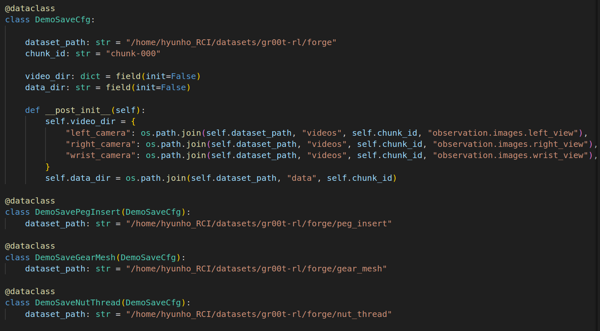

# VLA LAB

[](https://docs.isaacsim.omniverse.nvidia.com/5.1.0/index.html)
[](https://docs.python.org/3/whatsnew/3.11.html)
[](https://releases.ubuntu.com/22.04/)

## Overview

This repository is a framework that uses a VLA model as a backbone to improve success rates with RL.

## Installation

```bash
# 1) Conda env
conda create -n vla_lab python=3.11
conda activate vla_lab

# 2) Clone the repo
cd $HOME
git clone https://github.com/chohh7391/vla_lab.git
cd vla_lab

# 3) Isaac Sim SDK (v5.1.0)
pip install --upgrade pip
pip install "isaacsim[all,extscache]==5.1.0" --extra-index-url https://pypi.nvidia.com

# 4) Pytorch (CUDA 12.8)
pip install -U torch==2.7.0 torchvision==0.22.0 --index-url https://download.pytorch.org/whl/cu128

# 5) Isaac Lab (v2.3.0)
git clone -b v2.3.0 git@github.com:isaac-sim/IsaacLab.git _isaaclab
sudo apt install -y cmake build-essential
./_isaaclab/isaaclab.sh --install

# 6) Smoke test (headless sim)
python _isaaclab/scripts/tutorials/00_sim/create_empty.py --headless

# 7) Dev install
python -m pip install -e source/vla_lab

# 8) Extra dependencies
python -m pip install zmq scikit-learn pyarrow fastparquet av
```

- Using a python interpreter that has Isaac Lab installed, install the library in editable mode using:

    ```bash
    # use 'PATH_TO_isaaclab.sh|bat -p' instead of 'python' if Isaac Lab is not installed in Python venv or conda
    python -m pip install -e source/vla_lab

- Verify that the extension is correctly installed by:

    - Listing the available tasks:

        Note: It the task name changes, it may be necessary to update the search pattern `"VlaLab-"`
        (in the `scripts/list_envs.py` file) so that it can be listed.

        ```bash
        # use 'FULL_PATH_TO_isaaclab.sh|bat -p' instead of 'python' if Isaac Lab is not installed in Python venv or conda
        python scripts/list_envs.py
        ```

    - Running a task:

        ```bash
        # use 'FULL_PATH_TO_isaaclab.sh|bat -p' instead of 'python' if Isaac Lab is not installed in Python venv or conda
        python scripts/<RL_LIBRARY>/train.py --task=<TASK_NAME>
        ```

    - Running a task with dummy agents:

        These include dummy agents that output zero or random agents. They are useful to ensure that the environments are configured correctly.

        - Zero-action agent

            ```bash
            # use 'FULL_PATH_TO_isaaclab.sh|bat -p' instead of 'python' if Isaac Lab is not installed in Python venv or conda
            python scripts/zero_agent.py --task=<TASK_NAME>
            ```
        - Random-action agent

            ```bash
            # use 'FULL_PATH_TO_isaaclab.sh|bat -p' instead of 'python' if Isaac Lab is not installed in Python venv or conda
            python scripts/random_agent.py --task=<TASK_NAME>
            ```

### Set up IDE (Optional)

To setup the IDE, please follow these instructions:

- Run VSCode Tasks, by pressing `Ctrl+Shift+P`, selecting `Tasks: Run Task` and running the `setup_python_env` in the drop down menu.
  When running this task, you will be prompted to add the absolute path to your Isaac Sim installation.

If everything executes correctly, it should create a file .python.env in the `.vscode` directory.
The file contains the python paths to all the extensions provided by Isaac Sim and Omniverse.
This helps in indexing all the python modules for intelligent suggestions while writing code.

### Setup as Omniverse Extension (Optional)

We provide an example UI extension that will load upon enabling your extension defined in `source/vla_lab/vla_lab/ui_extension_example.py`.

To enable your extension, follow these steps:

1. **Add the search path of this project/repository** to the extension manager:
    - Navigate to the extension manager using `Window` -> `Extensions`.
    - Click on the **Hamburger Icon**, then go to `Settings`.
    - In the `Extension Search Paths`, enter the absolute path to the `source` directory of this project/repository.
    - If not already present, in the `Extension Search Paths`, enter the path that leads to Isaac Lab's extension directory directory (`IsaacLab/source`)
    - Click on the **Hamburger Icon**, then click `Refresh`.

2. **Search and enable your extension**:
    - Find your extension under the `Third Party` category.
    - Toggle it to enable your extension.

## Code formatting

We have a pre-commit template to automatically format your code.
To install pre-commit:

```bash
pip install pre-commit
```

Then you can run pre-commit with:

```bash
pre-commit run --all-files
```

## Troubleshooting

### Pylance Missing Indexing of Extensions

In some VsCode versions, the indexing of part of the extensions is missing.
In this case, add the path to your extension in `.vscode/settings.json` under the key `"python.analysis.extraPaths"`.

```json
{
    "python.analysis.extraPaths": [
        "<path-to-ext-repo>/source/vla_lab"
    ]
}
```

### Pylance Crash

If you encounter a crash in `pylance`, it is probable that too many files are indexed and you run out of memory.
A possible solution is to exclude some of omniverse packages that are not used in your project.
To do so, modify `.vscode/settings.json` and comment out packages under the key `"python.analysis.extraPaths"`
Some examples of packages that can likely be excluded are:

```json
"<path-to-isaac-sim>/extscache/omni.anim.*"         // Animation packages
"<path-to-isaac-sim>/extscache/omni.kit.*"          // Kit UI tools
"<path-to-isaac-sim>/extscache/omni.graph.*"        // Graph UI tools
"<path-to-isaac-sim>/extscache/omni.services.*"     // Services tools
...
```


# VLA-RL

## 1. Save Demo

- You can download pretrained base line policy [here](https://drive.google.com/drive/folders/1FtDIjFQs3Yy5Gnrr_lzFxlC8oiTt4yFa?usp=sharing) 

- The model trained in base_line must exist to start.

- Edit dataset_path in {}_gr00t_env_cfg.py



- PegInsert Demo Save
```bash
python scripts/rl_games/play.py --task=VlaLab-VLA-Gr00t-Forge-PegInsert-Demo-Save-Direct-v0 --headless --enable_cameras --checkpoint=<BASE_LINE_CHECKPOINT_PATH>
```

- GearMesh Demo Save
```bash
python scripts/rl_games/play.py --task=VlaLab-VLA-Gr00t-Forge-GearMesh-Demo-Save-Direct-v0 --headless --enable_cameras --checkpoint=<BASE_LINE_CHECKPOINT_PATH>
```

- NutThread Demo Save
```bash
python scripts/rl_games/play.py --task=VlaLab-VLA-Gr00t-Forge-NutThread-Demo-Save-Direct-v0 --headless --enable_cameras --checkpoint=<BASE_LINE_CHECKPOINT_PATH>
```

- Automate Demo Save
```bash
python source/vla_lab/vla_lab/tasks/direct/base_line/automate/run_w_id.py --assembly_id=<Assembly_ID> --train
```

- You can use hugging face
  - add `--huggingface` in terminal


## 2. Train Gr00t Model using Demo

- Install Isaac-GR00T

```
cd ~/

git clone https://github.com/NVIDIA/Isaac-GR00T.git
```

- install dependencies

```
cd Isaac-GR00T
conda create -n gr00t python=3.10
conda activate gr00t
pip install --upgrade setuptools
pip install -e .[base]
pip install --no-build-isolation flash-attn==2.7.1.post4 
```

- Replace the files at `Isaac-GR00T/gr00t/data/embodiment_tags.py` and `Isaac-GR00T/gr00t/experiment/data_config.py` with the files from the gr00t folder within the repository.
  
- change meta folder in dataset like `~/vla_lab/gr00t/meta`

- take care three things
  - 1st: In `episodes.jsonl`, edit "tasks" except "valid". And edit "length" to your total_frames
  - 2nd: In `info.json`, edit "total_episodes" and "total_frames"
  - 3rd: Change stats.json file using `vla_lab/gr00t/utils/get_stats.py`
  - 4th: In `tasks.jsonl`, edit "task" at "task_index": 0


- Train gr00t model

```
python scripts/gr00t_finetune.py \
   --dataset-path <DEMO_DATA_PATH> \
   --num-gpus 1 \
   --batch-size 32 \
   --output-dir <OUTPUT_DIR>  \
   --max-steps 20000 \
   --embodiment-tag franka \
   --data-config franka_triple_cam \
   --video-backend torchvision_av
```


## 3. Train VLA-RL Policy

- run gr00t server

```
cd ~/Isaac-GR00T

python scripts/inference_service.py --server --model_path <GR00T_MODEL_PATH> --embodiment-tag franka --data-config franka_triple_cam --denoising-steps 4 --port {PORT_ID}
```

- change port id to {PORT_ID} in source/vla_lab/vla_lab/envs/direct_rl_gr00t_env.py

- Train vla-rl policy

```
python scripts/rl_games/train.py --task=VlaLab-VLA-Gr00t-Forge-PegInsert-Direct-v1 --headless --enable_cameras --wandb-project-name=vla-gr00t-forge-peg_insert --wandb-entity={YOUR_ENTITY} --wandb-name={RUN_NAME} --huggingface
```

```
python scripts/rl_games/train.py --task=VlaLab-VLA-Gr00t-Forge-GearMesh-Direct-v1 --headless --enable_cameras --wandb-project-name=vla-gr00t-forge-gear_mesh --wandb-entity={YOUR_ENTITY} --wandb-name={RUN_NAME} --huggingface
```

```
python scripts/rl_games/train.py --task=VlaLab-VLA-Gr00t-Forge-NutThread-Direct-v1 --headless --enable_cameras --wandb-project-name=vla-gr00t-forge-nut_thread --wandb-entity={YOUR_ENTITY} --wandb-name={RUN_NAME} --huggingface
```
