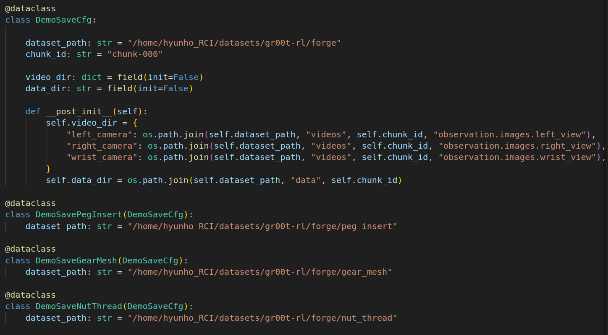

# 1. Save Demo

- The model trained in base_line must exist to start.

- Edit dataset_path in forge_gr00t_env_cfg.py



- PegInsert Demo Save
```
python scripts/rl_games/play.py --task=VlaLab-VLA-Gr00t-Forge-PegInsert-Demo-Save-Direct-v0 --headless --enable_cameras --checkpoint=<BASE_LINE_CHECKPOINT_PATH>
```

- GearMesh Demo Save
```
python scripts/rl_games/play.py --task=VlaLab-VLA-Gr00t-Forge-GearMesh-Demo-Save-Direct-v0 --headless --enable_cameras --checkpoint=<BASE_LINE_CHECKPOINT_PATH>
```

- NutThread Demo Save
```
python scripts/rl_games/play.py --task=VlaLab-VLA-Gr00t-Forge-NutThread-Demo-Save-Direct-v0 --headless --enable_cameras --checkpoint=<BASE_LINE_CHECKPOINT_PATH>
```


# 2. Train Gr00t Model using Demo

- Install Isaac-GR00T

```
cd 

git clone https://github.com/NVIDIA/Isaac-GR00T.git
```

- install dependencies


- Replace the files at Isaac-GR00T/gr00t/data/embodiment_tags.py and Isaac-GR00T/gr00t/experiment/data_config.py with the files from the gr00t folder within the repository.

- Train gr00t model

```
python scripts/gr00t_finetune.py \
   --dataset-path <DEMO_DATA_PATH> \
   --num-gpus 1 \
   --batch-size 32 \
   --output-dir <OUTPUT_DIR>  \
   --max-steps 10000 \
   --data-config franka \
   --video-backend torchvision_av
```


# 3. Train VLA-RL Policy

- run gr00t server

```
cd ~/Isaac-GR00T

python scripts/inference_service.py --server --model_path <GR00T_MODEL_PATH> --embodiment-tag franka --data-config franka_triple_cam --denoising-steps 4 --port {PORT_ID}
```

- change port id to {PORT_ID} in source/vla_lab/vla_lab/envs/direct_rl_gr00t_env.py

- Train vla-rl policy

```
python scripts/rl_games/train.py --task=VlaLab-VLA-Gr00t-Forge-PegInsert-Direct-v1 --headless --enable_cameras
```

```
python scripts/rl_games/train.py --task=VlaLab-VLA-Gr00t-Forge-GearMesh-Direct-v1 --headless --enable_cameras
```

```
python scripts/rl_games/train.py --task=VlaLab-VLA-Gr00t-Forge-NutThread-Direct-v1 --headless --enable_cameras
```